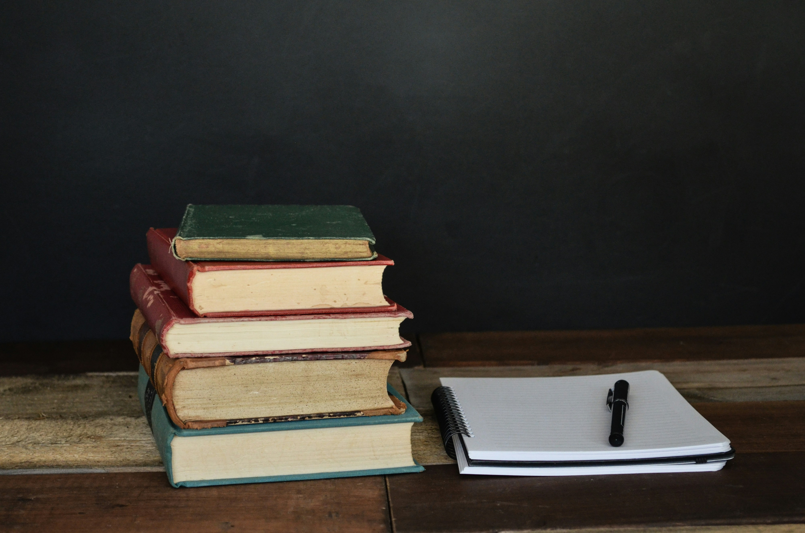
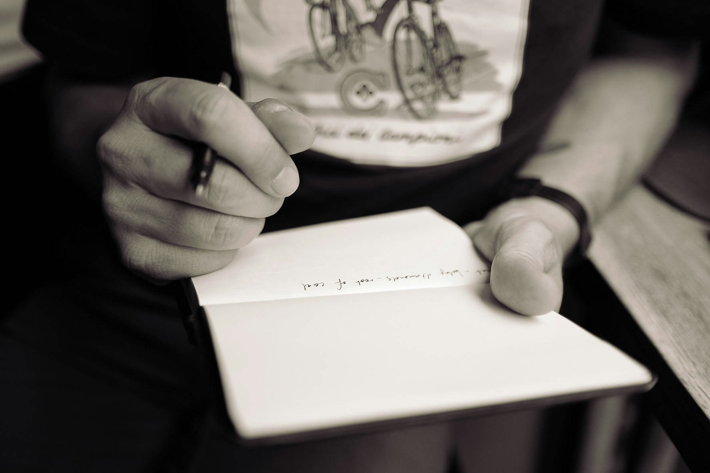
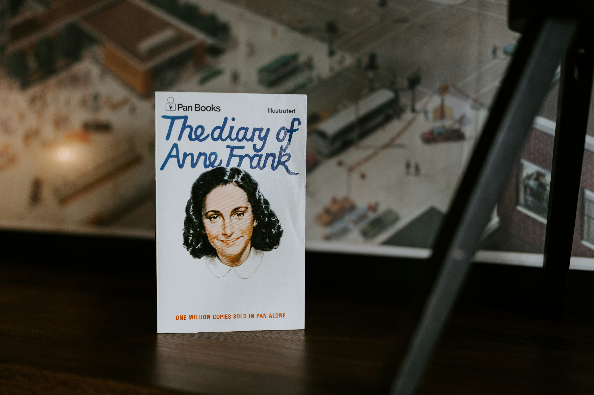
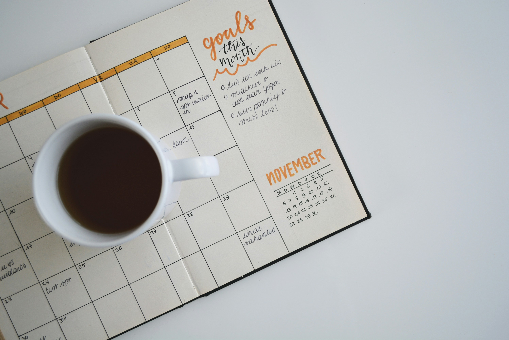

_This post is the first in a series called_ [I Finished A Book](https://ptrbrynt.com/tag/I-Finished-A-Book)_, in which I write about a book I’ve read recently. I don’t finish every book I start, so if I do manage to get to the end, that means I must have really liked it._

I am a bit obsessed with notebooks. Every time I see them for sale in a shop, it takes several ounces of my willpower to stop myself from buying a new one. I buy them much faster than I finish them.

This means I have a pile of blank and barely-used notebooks sitting in my office, and I’m constantly trying to find things to write in them. I recently read [**The Notebook: A History of Thinking on Paper**](https://www.google.co.uk/books/edition/The_Notebook/J8arEAAAQBAJ?hl=en&gbpv=0&kptab=getbook)&nbsp;by Roland Allen, which gave me some really interesting and unusual ideas.

## 1. _Zibaldone_

 

The term _zibaldone_&nbsp;(plural _zibaldoni_)_&nbsp;_first appeared in the middle of the 14th Century in Florence, Italy, but we’re not sure what the word originally meant. Someone records it as meaning “a salad of many herbs”, but it soon came into popular use to describe a particular use for a notebook.

A _zibalidone_&nbsp;is essentially a miscellany or personal anthology. It was used as a way of collecting all kinds of information, including recipes, lists, and quotations.&nbsp;

> What did people write in their _zibaldoni_? In a word: everything. Poems in Latin, poems in Tuscan, prayers, excerpts from books, songs, recipes, lists, you name it.

Essentially, it’s about collecting stuff you think you might find useful. Crucially, it doesn’t have to be neat or well-presented. I’ve started a _zibaldone_&nbsp;in a blank, unruled pocket notebook. So far it’s just extracts from books; the first page is a list of tactics I want to try from Jake Knapp and John Zeratsky’s&nbsp;_Make Time_.

It might sound like a pain to handwrite this stuff. Why can’t we just save links or photos or paste things into notes apps? Well, as many of us know, there are lots of cognitive benefits to writing by hand. Slowing down the process encourages your brain to actually process the information you’re writing, leading to increased understanding and better memory. Just taking a picture of a page in a book involves zero cognition, so you’re less likely to actually understand the thing you’re trying to save.

## 2. Common-placing

 

A common-place book feels a bit like a direct descendant of a _zibaldone_. This is a practice that was very popular among academics and scholars, starting with Erasmus of Rotterdam around 1512. It fell out of favour gradually, but common-placing is still used by certain contemporary writers.

A common-place book is essentially a place in which to collect quotes for later use in your own work. This is where it differs from a _zibaldone_, which is intended as a personal reference.

As a result of this more academic or scholarly purpose, common-place books tend to be more formal, with entries organised in indexed sections according to topics or themes.

If you enjoy writing in any form, a common-place book might be a useful thing to keep around. Whenever you read something you might want to include or refer to in a piece of your own writing, make a note of it in a common-place notebook.

## 3. Waste book

 

The conclusion to _The Notebook_&nbsp;is a wonderful exploration of our relationship to writing on paper. Recent philosophers have posited that a notebook, used in the right way, can actually be thought of as part of your mind, rather than merely a tool. They can aid in processing complex ideas, or act as an extension of your working and long-term memory.

A waste book certainly ticks these boxes. Isaac Newton used one in order to support his mathematical study. Many of us have a little notebook on our desks to quickly jot down ideas, help us think through a problem, or simply remember something I want to say during a meeting or conversation.

A waste book is intended as a temporary first home for thoughts. They are messy, unorganised, and not intended for consumption or use by anyone else. Later, relevant or important notes can be extracted and organised as needed. I used a waste book to write this post, by making notes as I was going through each chapter of _The Notebook_&nbsp;to decide what I wanted to include.

## 4. Diary or journal

 

A diary or journal is simply a record of the stuff that has happened to you. Sometimes, it might include some writing about how it made you feel.

This has been a popular use for notebooks for quite some time, particularly as literacy rates increased. But why is it useful?

Often, writing in a diary about our experiences can be a comfort; a bit like confiding in a friend. Indeed, the opening lines of Anne Frank’s legendary and tragic diary read:

> _I hope I will be able to confide everything to you, as I have never been able to confide in anyone, and I hope you will be a great source of comfort and support._

It is widely accepted that keeping a daily diary is beneficial to your emotional state, particularly during times of stress or anxiety. Externalising your experiences and feelings on paper is an important and helpful processing method.

## 5. Self-care journal

 

A slightly different form of journalling is known as “expressive writing”. This is a genre in which someone writes about an upsetting or traumatic experience.

A large body of research shows that writing in this way leads to dramatic and unambiguous health benefits. People who perform expressive writing after experiencing trauma have been shown to experience:

- Reduced blood pressure

- Lower risk of heart attack

- Improved response to vaccinations

- Faster healing of wounds

- Improved grades at school, college or university

- Fewer sick days

- Lower risk of alcoholism after losing a job

This is a surprising list of _physical_&nbsp;benefits, and the correlation is so strong that researchers have suggested prescribing this practice as a treatment for PTSD.

You don’t have to use this method frequently, but if you do, it should go a long way towards helping you process difficult experiences.

## 6. Bullet journal

 

Invented by Ryder Carrol as a way of managing his ADHD, [Bullet Journalling](https://bulletjournal.com/) has become a bit of a phenomenon. The internet is filled with influencers posting beautifully decorated BuJo pages, and YouTubers frequently share tips, tricks, and “plan with me” videos showing how they use their Bullet Journals.

But the essence of a Bullet Journal is simple: keep a daily, monthly, and yearly log of to-dos, events, notes, and feelings. Engage in a reflection practice to stay organised and intentional.

I have personally found a bullet journal incredibly useful in helping me to navigate everyday life. I have previously failed to resist the allure of cool productivity software and apps, but digital devices are riddled with distractions, and apps often impose limitations which don’t work with my brain. A bullet journal is a customisable, simple, low-maintenance, and distraction-free system which I have come to really love and rely on.

## 7. Friendship book

 

This is a slightly left-field idea from early Dutch academic circles. Many of them kept _Stammbücher_, which were notebooks in which friends would write autographs, draw sketches, and write messages.

This feels a bit like an early precursor for Facebook, which was also originally intended as a way for students to stay connected. Many academics at the time would travel as part of their studies, and a friendship book was a great way to remember the people you had met. It also signalled your position in the social hierarchy.

If you’re feeling brave, and meet enough new people, you too might consider keeping a friendship book, and inviting new acquaintances to sign it and write a message. There’s a particular romance about this idea which appeals to me somehow.

## Conclusion

Notebooks are awesome, and _The Notebook_&nbsp;has shown me just how awesome they have been for hundreds of years. In a constantly changing world, people keep coming back to pen and paper to help them stay organised, run their businesses, fuel their creativity, or help them process their experiences and emotions. A notebook is a beautiful, versatile, and incredibly important object, and I am excited to make more use of my growing collection.