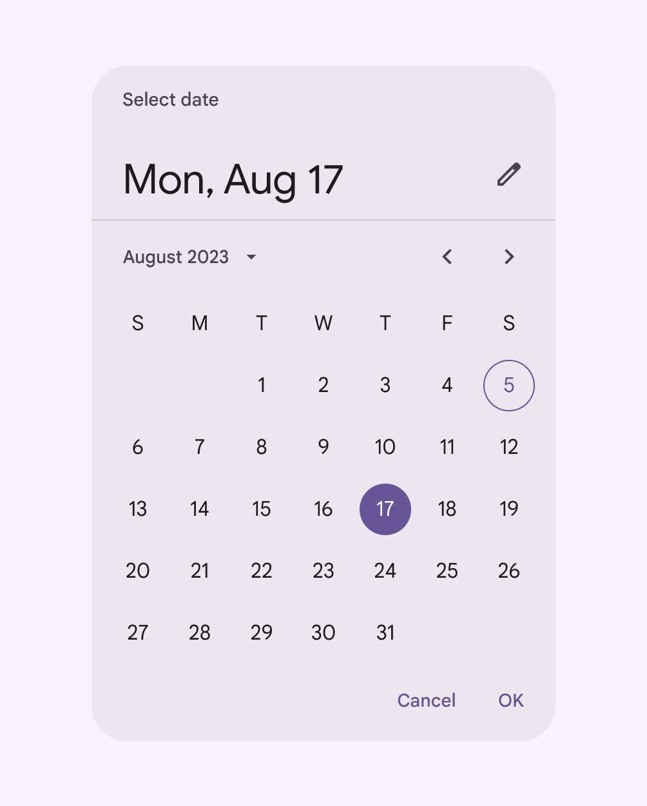
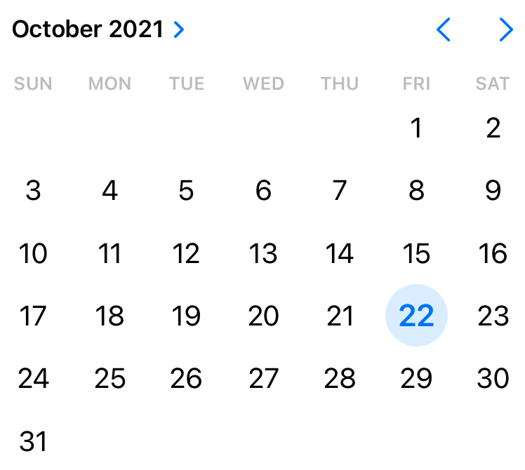

I hate date pickers.

   
*A date picker from Google’s Material Design system*

   
*A date picker from Apple’s iOS design system*

Why can’t we just tell the users what format we want, and let them type the date in? Maybe let them use a picker if they really want? It is _so much faster_&nbsp;to type a date, particularly one that’s very far away like a date of birth.

Sure, sometimes I need to see the calendar in order to know what date I need to pick (like setting a deadline for a task), but in those cases we can just let the user push a button to see the picker.

But we should never, ever, make a picker the _only_&nbsp;choice for date entry. Just let me type.