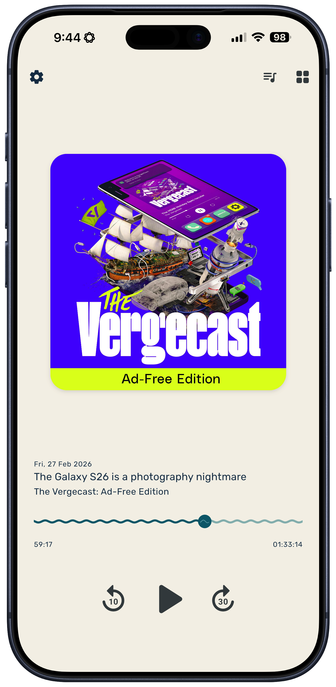
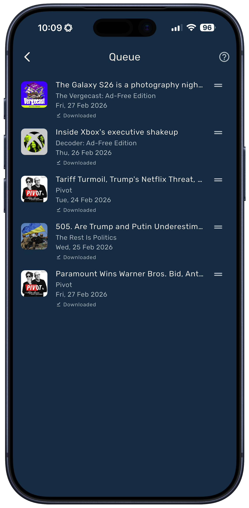
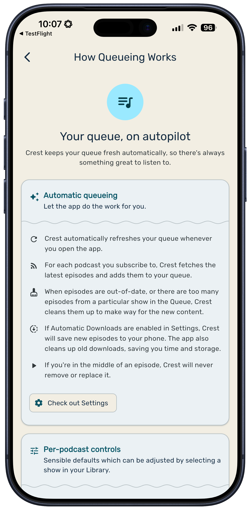

I hate that this was necessary. But I’m very pleased with the outcome.

Let’s start here: **I love podcasts.** I have listened to podcasts for as long as I have had access to them. I’ve even [made](https://open.spotify.com/show/0sYnIuLvXgCFhQ9Yek6bYR) a [few](https://www.fluttertwattle.com/) [podcasts](https://www.singbarbershop.com/pages/podcast). Podcasts are awesome.

But recently, I’ve had a niggling sense that I wasn’t enjoying them any more. They’d stopped being entertainment, and had turned into something else. Something less fun.

A recent (and very good)&nbsp;[essay](https://www.terrygodier.com/phantom-obligation) by Terry Godier brought this feeling into sharp focus. The feeling I was experiencing was **phantom obligation** : the sense that my podcast queue was constantly piling up in the background, and that I was a bad person if I failed to keep up.

In the past, my solution to this has been to listen to fewer shows. And that sucks, because I love podcasts! I want a big library full of fun, interesting stuff. But I also don’t care if I miss an episode here or there. I’m interested in variety, not completionism.

I wanted to find a piece of software which thinks about podcasts the way I do.

## The existing options

Apple Podcasts is shockingly bad at this. Here are a few issues I’ve discovered:

- Opening the app presents you not only with your own queue, but an overwhelmingly infinite list of other things you haven’t listened to but definitely should because they’re popular

- New episodes get added to the **front** of your queue, meaning that episode you’ve been trying to get to for days keeps getting pushed further and further down

- If you listen to one episode from a show —&nbsp;even if you don’t subscribe — it will start queueing new episodes of that show

- It’s impossible to keep track of what’s queued, what’s saved, or what’s downloaded

As an Apple Podcasts user of many years, these realisations led me to rage-quit and look for alternatives.

I tried Pocket Casts, which I used and enjoyed many years ago but whose vibe has become… odd since their acquisition. I just don’t _like_ using that app. Plus it’s kinda buggy (especially the macOS version) and has looked the same for a very long time.

I also tried an indie app called Queue, which I actually really enjoyed until I realised that the queueing behaviour was weird (again, new stuff goes to the top for some reason), and the app was&nbsp; buggy.

Overcast is too fiddly and not very pretty. And the countless other podcast apps on the App Store seem dubious in various ways. Do I trust them with my data? Do I have to stare at ads while I use them? Do they just look kinda _bad_?

A few weeks ago, I came to the conslusion that if nobody was going to fix my problems for me, I should pick up the tools and very well fix them myself.

## How I approached it

Again, my inspiration for this app was very much inspired by Terry Godier’s essay, which eventually turned into an RSS reader called [Current](https://www.terrygodier.com/current). Current uses very similar metaphors to my app, and I like it very much.

Here’s what I was aiming for:

- I never want to feel overwhelmed when I open the app

- I want to be able to open it and hit play, and not be surprised by what I hear

- I don’t want episodes to pile up like a to-do list; I want them to flow like a river. In other words, the app should be allowed to remove stale stuff from my queue without asking

- I want it to be private, non-predatory, and just generally good vibes

## What I built

So here it is. It’s called _Crest_, and the first thing you see when you open it is the Now Playing screen.

 

This is very much _not_ an overwhelming welcome. You don’t get served with a massive queue, or any recommendations. Just the thing that’s relevant _right now_: a big Play button.

### The Queue

 

I’m proud of how this queue works, but it’s pretty complicated. My instinct when building software is to avoid complexity, particularly when it’s behaviour that happens automatically. But then I remembered that the whole point of this app was that it would do the queue management for me.

So I decided that complexity is fine, as long as it’s transparent and understandable. To that end, I’ve included an entire screen which explains — in great detail — how the Queue works.

 

In general, the automatic behaviour is designed to be set-and-forget. By default, each show is only allowed **one spot** in the queue. If a new episode is released, it replaces any episodes of that show which are currently in the queue (unless it’s currently playing). Episodes also get added to the **end** of the queue by default.

Each show gets its own settings, so you can customise:

- How many episodes are allowed in the queue at once

- Whether new episodes get added to the start or end of the queue

- Whether to automatically expire episodes after a certain time limit (great for news shows which go out-of-date very quickly)

And, of course, you can manually manage your queue in a few ways:

- Reorder episodes however you want

- Mark as Played

- Release —&nbsp;remove from the queue without marking as played<a class="footnote-ref" data-id="7fb759a6-1501-4eed-99ce-5aaa3832f7a9" href="#fn:1">1</a>

- Save — prevent the app from automatically removing

Episodes of subscribed shows can also be manually added to the queue, but this won’t affect anything that happens in the future. The app won’t suddenly start queueing stuff up you didn’t ask for. Because _that would be insane._

### Private by design

All your data is stored on your phone.

That’s pretty much the entire privacy policy. The tradeoff is, of course, that you don’t get cross-device sync.<a class="footnote-ref" data-id="3dd52f31-4e39-4355-a48c-9ad0461849bb" href="#fn:2">2</a> This was a hard decision but, for me at least, the pros outweight the cons. I do 95% of my podcast listening time on my phone, so moving the final 5% (which was on my Mac while working) won’t be too difficult. That’s what AirPlay and wireless headphones are for, I guess.

There _is_ a small caveat, which is that I wanted product analytics. So when you start the app, I ask if you want to opt in. If so, I collect anonymous usage. If not, I’ll never bother you about it again (unless you want to go into Settings and turn it on).

Why is there analytics? To be honest, I’m just curious to know whether I’m right about all of this. And if I’m _nearly_ right, I want to understand how I can improve things. And if I’m definitely not right, I want to know that too, so I can spend my time doing something more useful.

## Wanna try it?

If this is vibing with you, I have a beta program open now for both iOS and Android. You can go to [crestpodcasts.com](https://crestpodcasts.com) for more info and a sign-up link. If you do, please know that you are awesome. And please tell me if Crest helps you enjoy podcasts more. That’s the whole point.

1. This idea seems stupid; you can just mark it as played. But for me, I feel bad when software makes me lie. If I haven’t played it, I don’t want to tell the app that I have.

2. You do get backups though, via your phone’s automatic backup system.